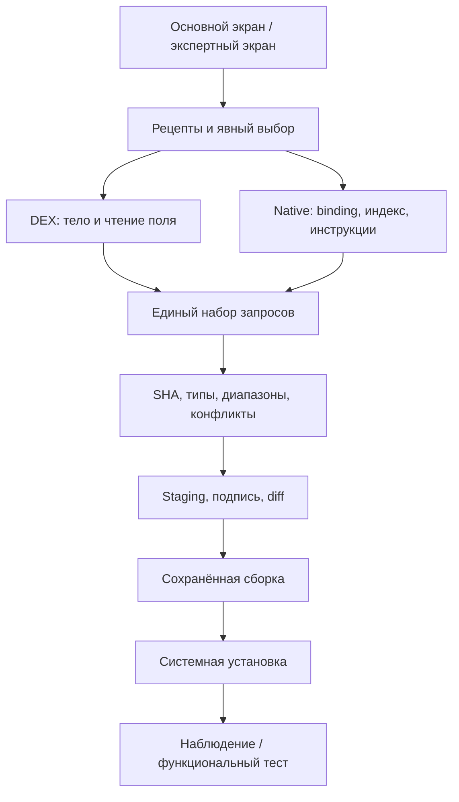

# Архитектурные решения 0.0.29–0.0.30

Дата: 25 сентября 2026. Основание: аудит baseline `cccbc92286b1267493f8d2e4e450ff3faa90f724`.

## ADR-01. Существующие исполнители остаются единственными

`DexLocalPatchEngine` продолжает переписывать DEX через dexlib2.
`Il2CppNativeMutationDraftBuilder` создаёт нативный запрос.
`MutationApplyCoordinator` и `VerifiedBuildPipeline` остаются единственным путём
предпроверки, изменения архивов, выравнивания, подписи и контроля результата.
Новый `AutoModBuildCoordinator` объединяет запросы обоих движков до применения.
Не создаётся вторая реализация APK writer, подписания или установки.

## ADR-02. Разные доказательства не подменяют друг друга

`ModificationVerification` разделяет кандидат, назначение, рецепт, статическую
проверку, сборку и проверку в работающей программе. Данные о сборке сохраняются
в `AutoModBuildRecord`. Отдельная строка пользовательского наблюдения не выставляет
`runtimeConfirmed`. У автоматически предлагаемых геттеров назначение остаётся
гипотезой до функциональной проверки. Ни ключевое слово в имени, ни успешная
запись инструкций не переводят цель в «работает в игре».

DEX-инспектор 0.0.29 проверял двухинструкционную передачу константы или поля в
возвращаемый регистр. В 0.0.30 добавлен обход конечного ациклического графа до
256 инструкций с пересечением фактов об определённости регистров на слиянии ветвей.
Вызовы, записи и обработчики исключений остаются блокерами. Тип и владелец поля
проверяются. Частично обфусцированное имя геттера допускается, если фактическое поле
даёт классификационный сигнал. Неподдержанное тело остаётся кандидатом с причиной;
весь DEX не прекращает исследоваться из-за одной такой цели.

## ADR-03. Связанные чтения — одна функция

Группа DEX формируется по точному `(APK, DEX, владелец/имя/тип поля, действие)`.
Два геттера одного поля не превращаются в два независимых переключателя.
Методы разных полей или с разными действиями автоматически не объединяются.
Изменение категории целиком не считается доказанной зависимостью.
Вычисляемый геттер не наследует идентичность одного из полей, участвующих в формуле:
такой вывод потребовал бы отдельного доказательства эквивалентности выражений.

## ADR-04. Индекс адресов не зависит от размера показанного списка

`NativeFunctionIndexWriter` сортирует смещения блоками по 65 536 чисел на диске,
объединяет их и записывает смещение, число ссылок и следующую границу. В памяти
не хранится отдельная объектная HashMap для всех нативных функций. Индекс имеет
SHA-256; перед построением патча проверяется его целостность. Неполный или
изменённый индекс блокирует автоматическое изменение. Версия кэша повышена.

Область индекса — указатели всех **восстановленных CodeGenModule**, а не любые
существующие функции ELF. Это не доказательство полной декомпиляции библиотеки
и не полное восстановление generic method registration. Лимит богатых bindings
30 000 / fallback 5 000 ещё существует. Полноценная постраничная материализация
метаданных и продолжение за этим пределом остаются незавершённой задачей.

## ADR-05. Жизненный цикл и результат

`AutoModViewModel` владеет операцией и отменой; поворот экрана не создаёт второй
процесс сборки. Выбор связан с SHA исходника. Сохранённая запись успешной сборки
содержит пути, размеры, SHA, signer set и список изменений. Перед установкой
файлы проверяются заново. Сборки имеют отдельные каталоги. Смерть процесса во
время незавершённой сборки не означает её завершение; автоматического продолжения
с середины архива пока нет.

Основной экран содержит категории и ленивый список, поиск, причины недоступности,
закреплённые действия и состояние операции. Ручной редактор и технические отчёты
доступны через меню «Ещё». Предварительный выбор всех рецептов удалён.

## ADR-06. Установка и экспорт

`VerifiedApkTransfer` сверяет размер и SHA фактически отправленных байтов до
`session.commit`. Отмена/несоответствие приводят к abandon незавершённой сессии.
Отказ открыть Activity из фонового receiver сохраняет USER_ACTION_REQUIRED;
его нельзя выдавать за отказ в установке. Исходная игра не удаляется приложением.

Для split-набора используются отдельные APK, одна PackageInstaller-сессия и
одна подпись. Экспорт на Android 8/9 использует SAF directory, на 10+ MediaStore.
ZIP остаётся отдельным экспертным экспортом. Автоматическое удаление предыдущих
успешных результатов запрещено архитектурой каталогов вывода.

## ADR-07. Нативная скалярная замена требует проверенного тела

В 0.0.30 каталог использует точную привязку типа, полный проверенный индекс
указателей восстановленных модулей и ограниченное следующей функцией окно кода.
`AArch64ReadOnlyBody` проверяет все достижимые пути в окне до 1024 байт: разрешены
поддерживаемые операции над регистрами, чтения, условные переходы и возврат.
Вызовы, записи, циклы, косвенные переходы, выход за окно и неизвестные инструкции
не считаются безопасными по умолчанию. Для void сохранён отдельный узкий рецепт
единственной записи поля; произвольное удаление void-функций не добавляется.

Скалярный метод с обычным именем `GetMaxHealth` проходит те же проверки, что
`get_MaxHealth`. Число/Boolean выбирается в UI из конкретных вариантов с заранее
вычисленными байтами; неподходящая длина и тождественная замена исключаются.
FMOV-immediate сокращает представимые float/double-патчи; остальные значения
используют существующий MOV-wide/FMOV encoder. Входной BTI сохраняется.
При этом назначение и игровой эффект остаются неподтверждёнными.

## ADR-08. Экспорт отражает решение каталога, а не только Finder

Существующий `PatchLabDiagnosticReportWriter` расширен optional-снимком рецептов.
Основной экран передаёт текущие причины блокировки и уровни проверки; отдельная
таблица содержит короткие окна нативного кода для воспроизводимого разбора отказов.
Большие таблицы и окна пишутся последовательно. Отчёт сначала записывается во
временный файл; отмена сохраняет предыдущий завершённый отчёт. Полные APK и
библиотеки не включаются. Экспорт не отправляет данные автоматически: пользователь
выбирает получателя в системном меню Android.
