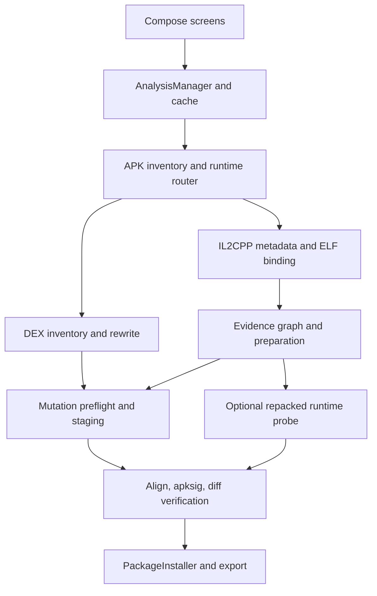

# ModKit: technical audit from source

Audit baseline: `cccbc92286b1267493f8d2e4e450ff3faa90f724`, 24 September 2026.
Branch: `audit/automod-reliability-20260924`. This document describes the baseline;
subsequent fixes and actual test results belong in `VALIDATION.md`.

## Scope and evidence

The repository was cloned with all advertised branches and complete available history
(1,042 commits across refs). Baseline has 229 files, 121 main Kotlin files / 40,943
lines, 77 Kotlin test files / 16,436 lines / 321 `@Test` annotations, and a 4,027-line
Java/C runtime probe. There is no `src/androidTest`, test game, Gradle wrapper, or
release entry. The complete mechanical source/import inventory is generated by
`python3 tools/audit_inventory.py`. This inventory is not proof that every line is
correct, reachable, or tested.

Baseline CI run [36029094952](https://github.com/Ffenuss/ModKit/actions/runs/36029094952)
passed JVM tests, lint, assemble, APK ZIP and alignment checks. It does not launch
ModKit or any patched game. The workflow only uploads APK/checksum artifacts and
does not retain detailed test reports. Baseline CI success is external evidence,
not a reproduced local functional test.

No Flick Shot Rogues APK/metadata/native binary is included in this repository.
The user's 160 / approximately 7 / 4 observations are user-reported measurements;
they cannot be independently recomputed from source alone. They must not be used
as a measured before/after benchmark.

Update, 25 September: the user's archived Patch Lab report was subsequently
retrieved and analysed. Its 189 rows / 7 selectable entries and exact blocker
breakdown are recorded in [FLICK_SHOT_DIAGNOSIS.md](FLICK_SHOT_DIAGNOSIS.md).
It contains reconstructed metadata and bindings, but no native machine code or APK;
post-change coverage of that game is still unmeasured.

## Architecture and dependencies

| Component | Actual baseline behavior | Completeness / action |
|---|---|---|
| Target selection, installed app repository, dumper | Reads base and installed splits; SAF file import; scoped dump export | Preserve. A ZIP advertised as APK-set is not automatically a proven installable set. |
| AnalysisManager / RunStore / EngineResultCache | Process-scoped coroutine analysis, heartbeat, cancellation, serialized SHA/version caches, interrupted-run recovery | Preserve; foreground longevity and process-death build recovery need device tests. |
| FastArtifactIndexer / profiler / router | Validates format headers and detects multiple runtimes | Detection is not mutation support. .NET, Flutter, Hermes, Unreal, Godot, Lua etc. have unavailable deep routes. |
| DexInventoryEngine | Reads DEX tables and counts | Inventory does not infer game mechanics. |
| DexLocalPatchEngine | Name/signature classification; exact dexlib2 method replacement and reparse | Real emitter. Discovery lacks method-body semantics and stops at display cap. |
| IL2CPP metadata reader | Random-access layouts v27–31 with explicit table limits | Encrypted/unsupported metadata and truncation remain blockers. |
| IL2CPP CodeGen scanner | Registration/symbol/relocation fallback, token-to-slot binding, return-kind recovery | Real parser, partial materialization. Full module pointer census is needed independently of presentation. |
| AArch64 decoder/CFG/analyzer | Decodes selected instruction families, builds bounded CFG, recognizes method shapes | Useful expert analysis, not a complete ARM64 semantic interpreter. |
| GameplayModificationFinder / triage | Name and owner-based categories, scalar presets, shared-body rejection | `EXACT_ACTION` does not prove game semantics. Numeric constants are test values, not inferred game-safe values. |
| Native draft / mutation preflight / archive applier | Source identity, range and conflict gates, streaming archive rewrite, signature stripping | Preserve executor. Incomplete method list weakens shared-body/span reasoning. |
| Build pipeline | Isolated signed output, 16-KiB library alignment, v2/v3 signing, signature/diff/manifest checks | Genuine structural checks, not Android launch or gameplay validation. |
| PackageInstaller / export | One session for APK set; unknown-source settings; explicit confirmation; signer conflict; Downloads output | Latest fixes exist. Needs real callback, process-death, OEM and permission tests. |
| Repacked probe | Manifest + DEX + native injection; maps/lookup/trace transport; local runtime menu | Mapping or patch read-back does not prove gameplay effect. Several trace coordinators have no main-code callers. |
| Compose UI | 2,420-line AutoMod screen plus 2,905-line manual section | Rendering, state, side effects and orchestration are mixed. Separate compact flow from expert presentation; reuse engines. |
| Root mode | Legacy docs/branches describe root features | Main manifest and navigation removed root flow in v0.0.16. Do not claim those old features are available. |

Dependencies: AGP/apksig 9.3.0, Gradle 9.5.0 in CI, Java 17, Kotlin Compose 2.3.21,
Compose BOM 2026.08.00, dexlib2 2.5.2 (BSD-3-Clause), NDK 28.2.13676358. No Internet
permission, paid service, telemetry or advertising dependency was found in the
main manifest/dependency declarations. Native payloads are built for four ABIs;
native automatic patch presets cover ARM64 only.

## Defects and architectural gaps

| ID | Severity | Evidence / cause | Required correction |
|---|---|---|---|
| A01 | High | `DexLocalPatchEngine` stops scanning at 256 candidates and truncates APK-set results; later DEX entries may never be examined | Separate scan coverage from UI pagination; cancellation inside method loops; regression beyond 256. |
| A02 | High | DEX `classify` inspects names/types, not instruction behavior; a getter name can conceal side effects | Inspect return dataflow and reject unsupported/side-effecting bodies; retain diagnostic candidates. |
| A03 | High | IL2CPP binding materialization stops at 30,000 / 5,000 on OOM | Index full pointer universe; expose exact partial coverage and continuation rather than silent truncation. |
| A04 | Critical correctness risk | Native shared-body counts and next-function span use only materialized graph targets | Check all module pointers before declaring uniqueness or a patch span; incomplete census must fail closed. |
| A05 | High | `GameplayModificationFinder` defaults to 64 total / 4 per category; manual UI 256 / 32, native target list 24 | Pagination belongs in presentation, not semantic discovery. |
| A06 | High | No runtime test projects; zero Android instrumentation tests | Add self-authored fixtures and execute original/patched logic on ART; install/launch tests separately. |
| A07 | High | AutoMod operations live in Compose `remember` / screen coroutine scopes | Rotation/navigation/process termination can lose build state; use retained session ownership and persistent results. |
| A08 | High | Runtime address confirmation can be confused with behavior confirmation in terminology | Persist separate candidate / semantics / recipe / static / built / functional stages with provenance. |
| A09 | Medium | `AutoModSelectionPolicy` preselects every eligible ordinary native patch | Start unchecked. One category may contain incompatible or unintended changes. |
| A10 | High | Native and DEX UI build operations use separate staging preparations | Merge concrete requests into one conflict-checked transaction; do not overwrite one engine's selected changes. |
| A11 | High | Installer verifies file hash before opening session, then reads file again without checking copied bytes | Hash and size must also match the bytes written to the session before commit. |
| A12 | Medium | Pending confirmation is in-memory; callback launch exception is published as installation failure although the session still waits | Preserve USER_ACTION_REQUIRED and explicit retry; document/reconcile process restart. |
| A13 | High | Whole DEX byte arrays plus rewrite copies; memory-bound metadata; ZIP64/resource-size restrictions | Report bounded unsupported inputs and remaining coverage; stream/random-access where feasible. Never catch OOM as an ordinary negative scan. |
| A14 | Medium | README accumulates contradictory per-version export instructions; ROADMAP marks removed root UI as complete | Current capability matrix must override historical notes; no universal-ready claim. |
| A15 | Medium | No Gradle wrapper or retained XML test artifacts | Reproducible build entry and downloadable validation evidence. |

Large targets also multiply I/O: source SHA checks and post-build analysis reopen
the complete APK set; file imports rematerialize the URI. These are integrity gates,
not arbitrary work: optimize by immutable source snapshots rather than removing
checks. Disk preflight exists for build output but needs coverage of input copy,
staging, extraction and export volumes.

## Candidate pipeline diagnosis

Discovery can yield a method-name signal, a metadata field without object location,
or an exact native binding. These are different units. Classification does not
establish that an HP getter controls damage rather than HUD display. Unknown return
types cannot safely use a float/integer/struct ABI interchangeably. Shared native
bodies may represent multiple generic methods; patching one affects all users.
Void methods can contain required state updates, so replacing every damage-like
method with RET is not a justified generic recipe. Rewriting a getter cannot prove
that callers use it. Server-owned state remains outside a local patch's authority.

Implementation gaps are solvable separately: lost candidates behind display caps,
unrecovered registration/type tables, supported numeric recipe gaps, absent
call/field relationships, and untested installer callbacks. Do not label these
"impossible". Conversely, removing a guard without an alternative proof does not
increase validated coverage.

## Baseline status

Source audit and CI-log inspection are complete at the subsystem level. Dynamic
baseline reproduction, UI inspection, and real-game coverage are NOT complete at
this point. A full ready-product claim would be false. Detailed validation must
record each actual command/device/fixture, not infer success from this document.

Baseline reproduced in [run 36055340587](https://github.com/Ffenuss/ModKit/actions/runs/36055340587):
323 JVM tests, 2 failures. Both new `DexCoverageRegressionTest` cases fail on the
unchanged engine (320 methods in one DEX; 640 across two DEX entries). The existing
321 tests pass. After the first engine correction, the local run reports 326 tests,
0 failures; this still says nothing about gameplay or installation.
